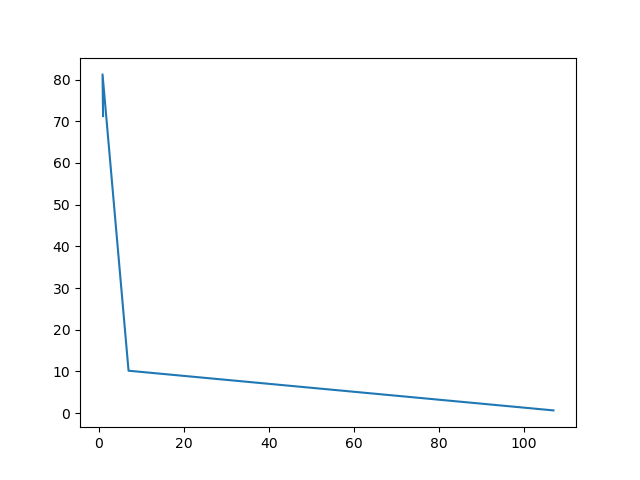
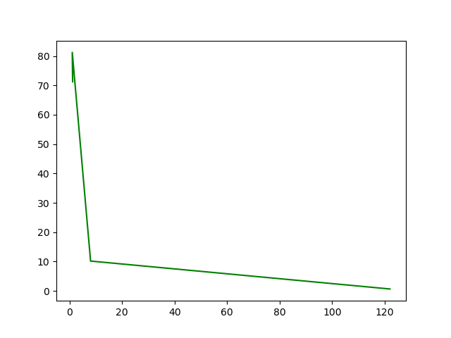
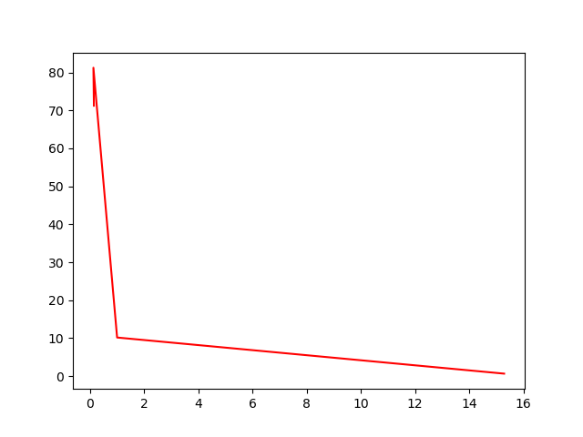
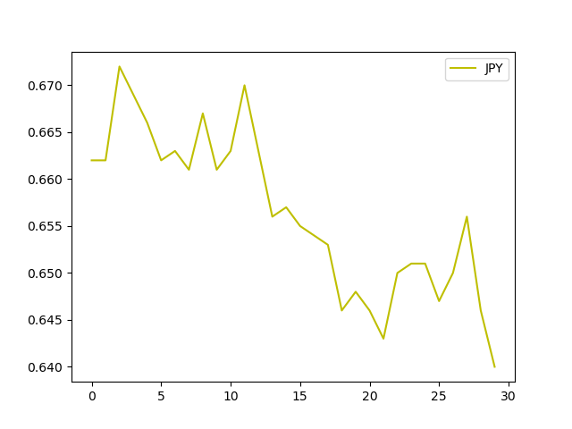

## Необходимо:

1. получить статистику валют за предыдущий месяц ( https://www.cbr-xml-daily.ru/daily_json.js )  
  - доллар  
  - евро  
  - юань  
  - иена  

2. для каждой валюты выразить курсы других  

3. сохранить для каждой валюты статистику в базу  

4. по собранной статистике нарисовать график ( можно воспользоваться https://www.chartjs.org/ )  

### Что получилось
1. Да
2. Думаю да
3. Да
4. Да  
     
### График курса к дням. 
Количество дней 30   
   Доллар США  
     

   Евро  
     

   Юань  
     

   Йена  
     

### Если кто-то решит использовать скрипт  
#### Константы  
    url :str
    days :int -> сколько дней, столько страниц парсит скрипт  
    char_codes :list -> [коды валют]  
  
#### Функции  
Сигнатуры в коде перед функциями  
1. get currency - получает через API центробанка json -> парсит его в мапу. Структура в коде.  
2. exchange to - обмен валюты к списку -> возвращает курс от валюты к списку.  
3. exchange list - сахар для обмена коллекций.  
4. nominal to one - приведение номинала к единице.  
  Было: 100 йен -> стало: 1, было: 10 юаней -> стало: 1    
5. show - сахар для matplotlib графиков. Строит графики из коллекций.    

#### Дб
SQLite3
Pony orm - будь аккуратнее, иногда лямбды боль, но работает она и правда быстро. 
Не лезь в select, оно тебя сожрет.  

    Valutes(  
      id = PrimaryKey(int, auto=True)  
      char_code = Required(str)  
      date = Required(str)  
      to_usd = Optional(float)  
      to_eur = Optional(float)  
      to_cny = Optional(float)  
      to_jpy = Optional(float))  

#### API
  + API центробанка имеет лимит  
    5 запросов в секунду  
    120 запросов в минуту  
    10000 запросов в сутки  
