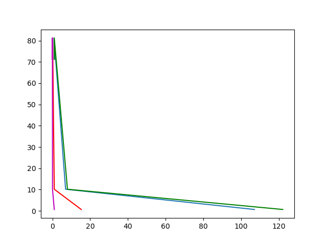

## Необходимо:

1. получить статистику валют за предыдущий месяц ( https://www.cbr-xml-daily.ru/daily_json.js )  
  - доллар  
  - евро  
  - юань  
  - иена  

2. для каждой валюты выразить курсы других  

3. сохранить для каждой валюты статистику в базу  

4. по собранной статистике нарисовать график ( можно воспользоваться https://www.chartjs.org/ )  

### Что получилось
1. Да
2. Думаю да
3. Да
4. Было очень непонятно...  
     
     
   Доллар США  
     

   Евро  
     

   Юань  
     

   Йена  
     

   Все вместе  
     
